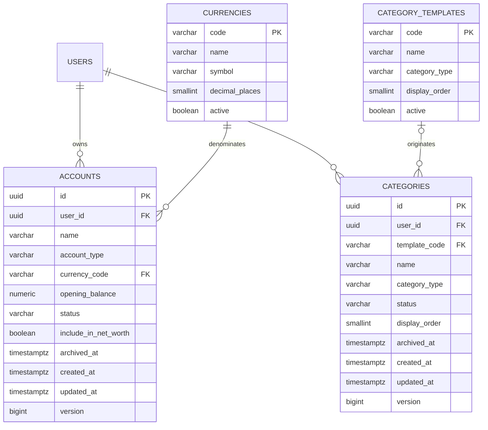

# FinTrack Accounts and Categories

## Overview

The accounts and categories domain provides the foundation for recording
financial transactions.

Every account and category belongs to one FinTrack user.

## Supported currencies

Supported currencies are stored in `finance.currencies`.

The initial currencies are:

- ZAR
- USD
- EUR
- GBP

Currency reference data is read-only to the running application.

## Accounts

Supported account types are:

- `CASH`
- `CURRENT`
- `SAVINGS`
- `CREDIT_CARD`
- `INVESTMENT`
- `OTHER`

Account statuses are:

- `ACTIVE`
- `ARCHIVED`

An archived account remains available for historical reporting but cannot be
used for new ordinary transactions.

Account balance is not stored as a mutable column. It will be calculated from:

```text
opening balance + posted transaction effects
```

## Account-name uniqueness

A user may have only one active account with a given normalized name.

Names are compared after:

1. Removing leading and trailing whitespace.
2. Converting them to lowercase.

Archived accounts do not prevent a new active account from using the same
name.

## Categories

Categories have one of two types:

- `INCOME`
- `EXPENSE`

Category statuses are:

- `ACTIVE`
- `ARCHIVED`

Transfers do not use income or expense categories.

## Category templates

FinTrack stores standard category definitions in
`finance.category_templates`.

When a user registers, the backend will copy active templates into
`finance.categories`.

Users may rename or archive their copied categories without changing the
global templates.

## ER diagram


