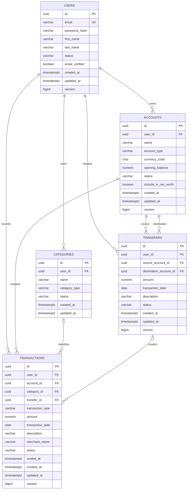

# FinTrack Core ER Diagram

```mermaid
erDiagram
    USERS ||--o{ ACCOUNTS : owns
    USERS ||--o{ CATEGORIES : owns
    USERS ||--o{ TRANSACTIONS : records
    USERS ||--o{ TRANSFERS : initiates

    ACCOUNTS ||--o{ TRANSACTIONS : contains
    CATEGORIES o|--o{ TRANSACTIONS : classifies

    TRANSFERS o|--o{ TRANSACTIONS : creates
    ACCOUNTS ||--o{ TRANSFERS : source
    ACCOUNTS ||--o{ TRANSFERS : destination

    USERS {
        uuid id PK
        varchar email UK
        varchar password_hash
        varchar first_name
        varchar last_name
        varchar status
        boolean email_verified
        timestamptz created_at
        timestamptz updated_at
        bigint version
    }

    ACCOUNTS {
        uuid id PK
        uuid user_id FK
        varchar name
        varchar account_type
        char currency_code
        numeric opening_balance
        varchar status
        boolean include_in_net_worth
        timestamptz created_at
        timestamptz updated_at
        bigint version
    }

    CATEGORIES {
        uuid id PK
        uuid user_id FK
        varchar name
        varchar category_type
        varchar status
        timestamptz created_at
        timestamptz updated_at
    }

    TRANSACTIONS {
        uuid id PK
        uuid user_id FK
        uuid account_id FK
        uuid category_id FK
        uuid transfer_id FK
        varchar transaction_type
        numeric amount
        date transaction_date
        varchar description
        varchar merchant_name
        varchar status
        timestamptz voided_at
        timestamptz created_at
        timestamptz updated_at
        bigint version
    }

    TRANSFERS {
        uuid id PK
        uuid user_id FK
        uuid source_account_id FK
        uuid destination_account_id FK
        numeric amount
        date transaction_date
        varchar description
        varchar status
        timestamptz created_at
        timestamptz updated_at
        bigint version
    }
```
