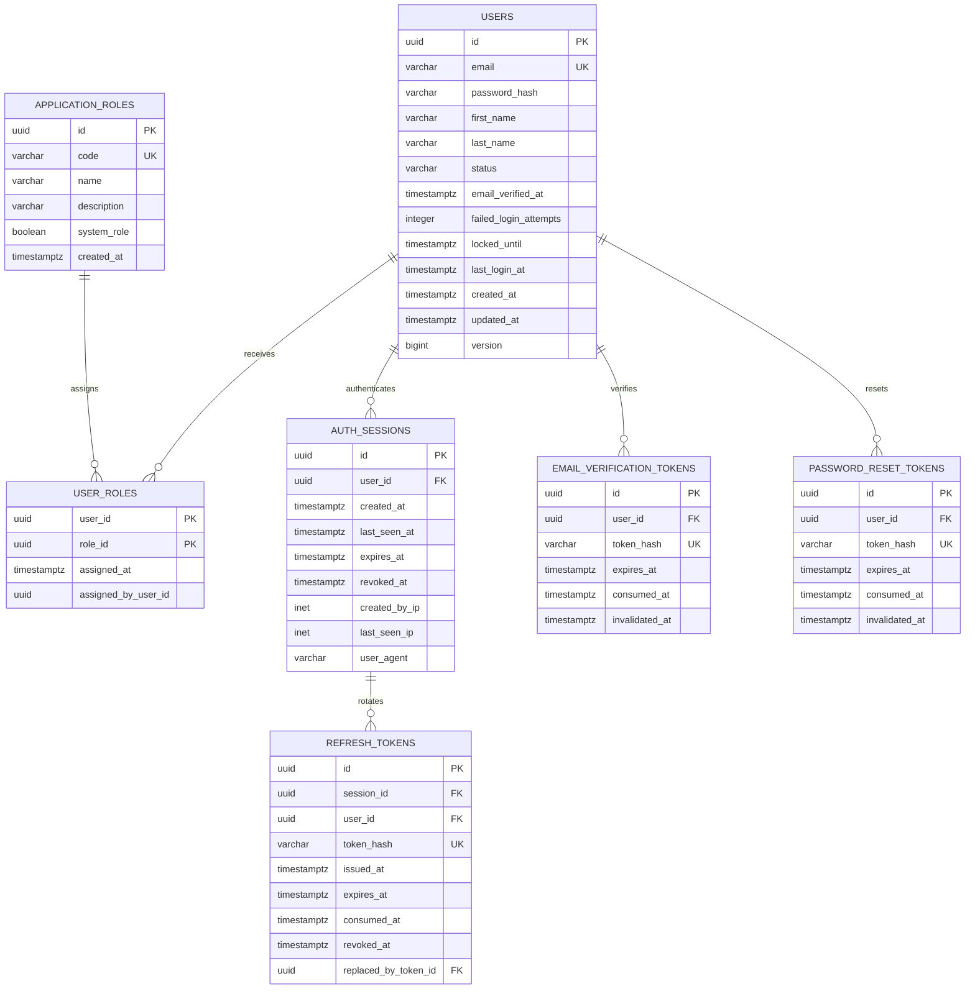

# FinTrack Identity Domain

## Purpose

The identity domain manages users, application authorization roles,
authentication sessions, refresh tokens, email verification, and password
recovery.

## Core rules

- User email addresses are normalized before storage.
- Email addresses are unique.
- Passwords are stored only as password hashes.
- Raw authentication and recovery tokens are never stored.
- Refresh tokens are rotated after successful use.
- Reusing a consumed refresh token may revoke its entire session.
- Authentication sessions can be revoked individually.
- A user may have at most one active email-verification token.
- A user may have at most one active password-reset token.
- Historical consumed and invalidated tokens are retained for security
  investigation and auditing.

## User statuses

- `PENDING_VERIFICATION`
- `ACTIVE`
- `LOCKED`
- `DEACTIVATED`

## Authorization roles

- `ROLE_USER`
- `ROLE_ADMIN`

## ER diagram

